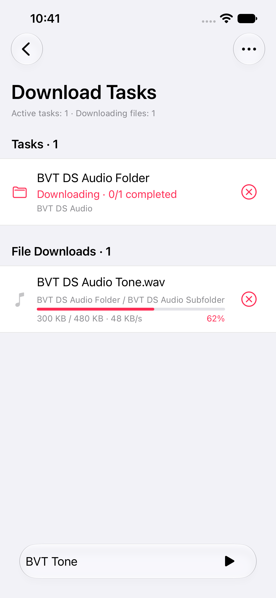
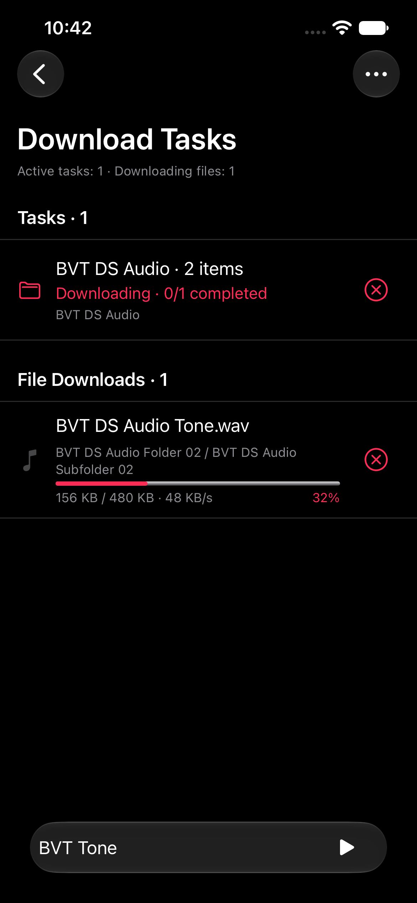
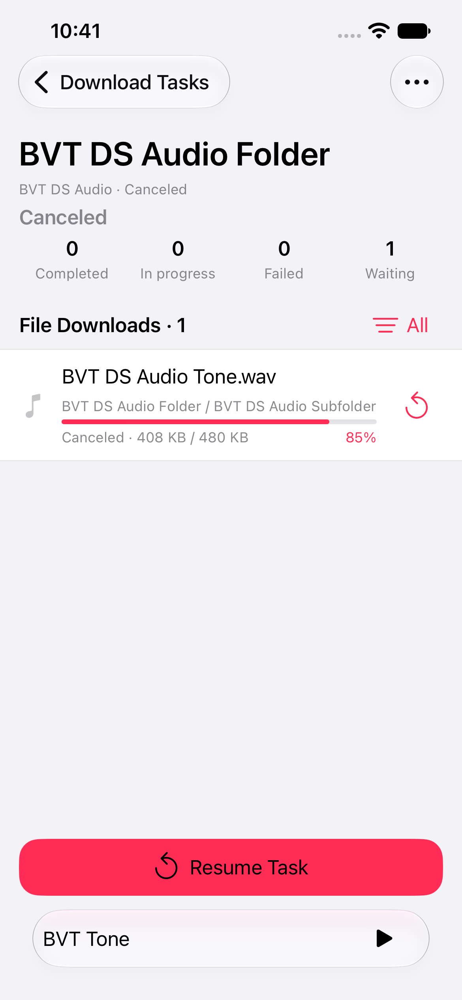

# 下载任务 V1 实施与验证

日期：2026-09-28。设计依据：[下载任务 V1](DownloadPageV1.md)。

## 提交基线

- 主仓库已有内容已提交：`0bdc4fd`，设计稿与在线源下载卡顿排查记录。
- 独立仓库 `thirdpart/amperfy` 已有配置已提交：`3db14ea4`。
- 本轮 App 实现保留在工作区，便于审阅。

## 已实施

| 范围 | 实现 |
| --- | --- |
| 两级任务 | 整次操作与音频、封面、歌词等实际文件分开；批量选择具有独立标识，递归目录属于同一任务 |
| 总览 | 任务、文件下载、待恢复、已完成四个分区；完成记录有独立历史页 |
| 详情 | 阶段与计数、目录展开状态、文件结果、附属文件；状态筛选，按 100 条加载明细 |
| 文件进度 | 字节数、可计算的百分比和速度；未知总量显示已下载字节，不编造百分比 |
| 取消 | 可取消整次操作或单个音频文件；已入库结果保留，旧回调不能覆盖新操作 |
| 恢复 | 保存选择范围与恢复上下文；重启后仍可恢复；跳过已经成功的文件 |
| 清理 | 确认后移除已完成任务及文件记录；重新核验当前状态，不调用资料库删除接口 |
| 风格 | UIKit、既有字体与颜色变量、原生 SF Symbols；适配浅色与深色 |

## 下载期间的主线程开销

- 高频字节进度独立存储并使用独立通知；更新对应可见文件行，不复制整份历史字典，不触发目录列表刷新或持久化。
- 目录页离屏后停止订阅；每次渲染建立一次项目索引与行签名，移除逐行重复搜索。
- 持久化在 utility 串行队列合并写入；停止服务时等待落盘。
- 整次操作排队运行，递归批量内部最多 3 个文件并发；共享封面只下载一次。
- 下载文件的移动、复制使用 utility 任务；完成历史按任务清理。

## 验证记录

- 下载队列 13 项测试通过：递归恢复跳过成功文件、单文件取消、旧进度回调、排队、历史清理、重叠任务明细、共享封面、重启恢复、旧 JSON 兼容、入库终态释放队列等。
- 真实 URLSession 与分段本地 HTTP 响应的进度、取消测试通过；合并持久化与 flush/clear 测试通过。
- 浅色递归下载、详情、取消、恢复、已完成历史、清理确认与空状态流程通过。
- 深色批量选择两个文件夹、文件进度、任务取消流程通过。
- 基础设施 233 项测试通过，包含真实下载进度、取消与持久化测试；390 点与 440 点宽的模拟器均通过下载页流程。
- 初次扩展 UI 功能测试有 3 项资料库/歌词测试失败；这 3 项单独复验均通过。未修改这些测试及其业务实现。
- 架构检查与 `git diff --check` 通过。

最终验收结果与截图保存在 `.noindex/artifacts/download-tasks-v1-acceptance.xcresult`；对应日志为 `.noindex/logs/download-page-acceptance-tests.log`。

390 点小屏最终截图与取消计数断言通过的结果为 `.noindex/artifacts/download-tasks-v1-final-screens.xcresult`；日志为 `.noindex/logs/download-page-final-screens-tests.log`。

## 实际截图

| 浅色总览 | 深色批量任务 | 取消后恢复 |
| --- | --- | --- |
|  |  |  |

[浅色详情](Implementation/Light-Detail.png)、[深色详情](Implementation/Dark-Detail.png)、[完成详情](Implementation/Completed-Detail.png)、[完成历史](Implementation/Completed-History.png)、[清理确认](Implementation/Clear-Confirmation.png)、[清理后空状态](Implementation/Empty-History.png)。

## 使用范围

恢复是任务层面的继续执行。当前 DS Audio、Google Drive 未增加 HTTP Range 或 URLSession resumeData 续传；未完成文件重新下载，成功文件不重复下载。递归恢复会重新核验远端目录，并利用成功记录去重。

新增文案提供中文与英文，其余语言使用英文回退。没有使用真实账号或真机完成大规模在线源下载的帧率压测，因此不把模拟器功能通过作为原卡顿已经完全消失的证明。

## Review 后修复

详见 [Review 修复记录](DownloadPageV1-Review.md)。

- 新建目录操作与恢复操作分开：新操作具有独立 ID，持久化 Provider 目录对象；恢复沿用原任务 ID。已有旧版记录仍可恢复。
- 共享附属文件仅在本次操作内去重；跨操作和恢复未完成音频时重新取得实际文件，保留原任务历史。
- 任务汇总消除“每个任务扫描全部文件”，文件状态通知不再重建所有归档；下载页汇总与详情排序移至后台，取消旧页面计算。
- 目录页支持取消排队任务；取消/失败后的重试继续原任务，完成后的再次导入创建新任务。
- 核心队列回归增至 20 项并通过；同一 Debug 探针的 500 个任务/10,000 条文件汇总约 18 ms，修复前约 446 ms。
- 最终 390 点模拟器的 3 项下载页交互和 4 项在线源入库场景测试通过：`.noindex/artifacts/download-review-fix-final.xcresult`；对应日志 `.noindex/logs/download-review-fix-ui-final.log`。

## 第二轮 Review 后修复

日期：2026-09-29。详见 [第二轮 Review 与修复记录](DownloadPageV1-Review-R2.md)。

- 目录发现改用文件 ID 索引；封面与歌词关联移到后台，最终状态注册每批最多 500 条并检查取消、让出执行机会。
- 单文件取消状态归属整次任务；文件行取消携带所属任务 ID，同一文件在其他任务中的下载不受影响。
- 新建单曲统一进入现有任务执行器并拥有独立 ID；恢复沿用原任务 ID。旧版单曲请求保留身份和元数据，重复下载保留各次历史。
- 父任务取消时保留已经成功的子文件结果；单曲仍显示单曲图标和既有入库反馈。
- 同机 Mac Debug 的 10,000 文件目录发现探针：最大 MainActor 调度间隔约 9,496 ms → 17.84 ms；发现总耗时约 9,634 ms → 535 ms。尚未做 Release 真机性能验证。
- 核心队列回归增至 26 项并全部通过，包含本轮六个新增场景；最终代码的 5 项在线源场景测试通过。
- 3 项原生下载页交互测试通过；其执行早于最后的后台目录关联优化，该优化后重跑了核心与场景测试。
- 架构检查与 `git diff --check` 通过；修改尚未提交。

证据：`.noindex/logs/download-r2-fix-core.log`、`.noindex/logs/download-r2-fix-probe.log`、`.noindex/logs/download-r2-fix-ui-final.log`、`.noindex/logs/download-r2-fix-scenes.log`。模拟器结果：`.noindex/artifacts/download-r2-fix-final.xcresult`、`.noindex/artifacts/download-r2-fix-scenes.xcresult`。
