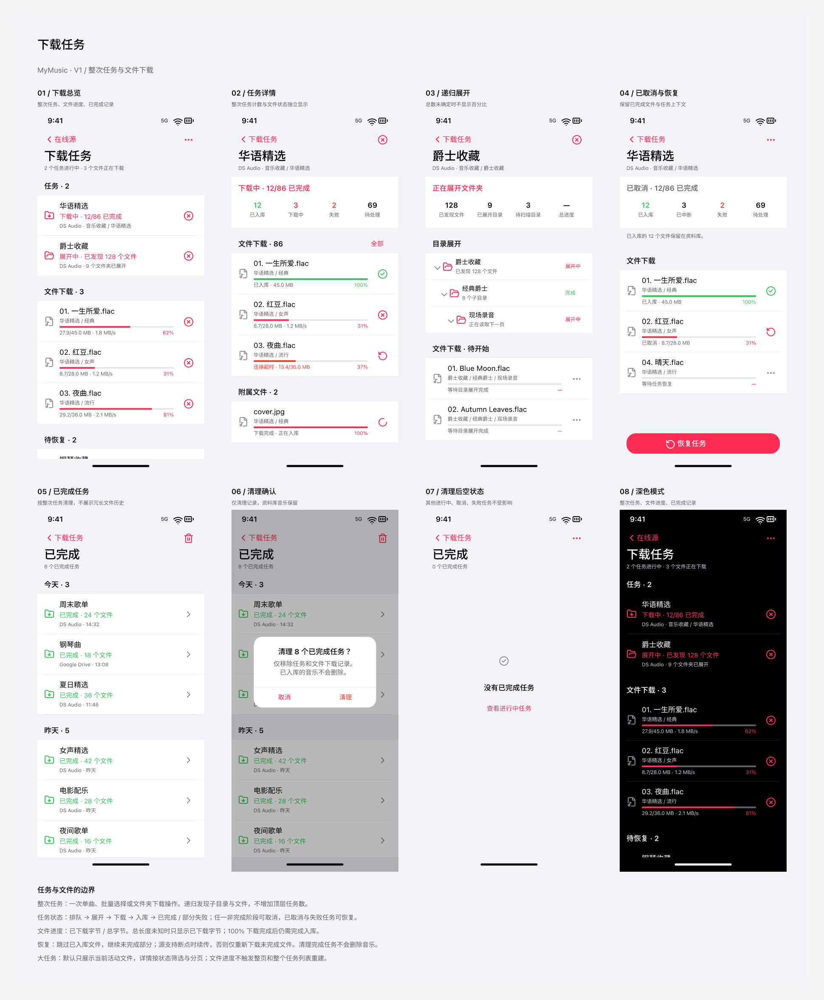

# 下载任务页面 V1 设计稿

日期：2026-09-28。范围：页面设计、状态与交互约定；本轮未修改 App 实现。

## 设计入口

- [Figma 设计总览](https://www.figma.com/design/DfZ9E3D6LfZZdQS6fPqT7s/MyMusic?node-id=599-886)
- [下载总览画板](https://www.figma.com/design/DfZ9E3D6LfZZdQS6fPqT7s/MyMusic?node-id=593-92)
- [原型预览](https://www.figma.com/proto/DfZ9E3D6LfZZdQS6fPqT7s/MyMusic?page-id=586%3A2&node-id=593-92&starting-point-node-id=593%3A92)
- 文件内页面：`下载任务 · V1`。

## 视觉与信息结构

沿用 MyMusic 的 SF Pro、粉色操作色、系统分组列表及现有浅色/深色变量。没有新增主题色或替换原有页面。

总览按以下顺序组织，内容可纵向滚动：

| Section | 展示内容 | 主要动作 |
| --- | --- | --- |
| 任务 | 整次操作名称、来源路径、阶段、已完成文件数 | 打开详情、取消任务 |
| 文件下载 | 当前活动文件、所属任务/目录、字节数、速度、百分比 | 取消单个文件 |
| 待恢复 | 已取消、部分失败的整次任务及保留的完成计数 | 查看详情、恢复/重试 |
| 已完成 | 已完成任务数量与最近记录 | 打开历史、清理 |

任务详情展示阶段和计数，再展示文件明细。大任务按状态筛选并分批加载；不要求在总览展开全部文件。

## 两级任务定义

**整次任务**对应用户的一次操作：下载单曲、批量选择多个文件，或下载一个文件夹。具有稳定的任务 ID、来源、选择范围和恢复上下文。一次递归操作只产生一个顶层任务。

**文件任务**对应实际的远端文件，隶属整次任务。记录远端标识、相对路径、文件类型、字节进度、失败原因和入库结果。音频、封面、歌词等文件可分组显示，但共同计入明确的整次任务统计口径。

**目录展开记录**保留目录层级、分页位置、展开状态、错误及去重标识，属于整次任务的内部发现过程。展开期间显示已发现文件、已展开目录和待扫描目录，不显示尚无依据的总百分比。

## 状态约定

| 对象 | 状态 | 展示与行为 |
| --- | --- | --- |
| 整次任务 | 排队、展开中、下载中、入库中 | 显示当前阶段；可取消 |
| 整次任务 | 已取消 | 保留进度与上下文；可恢复 |
| 整次任务 | 部分失败、失败 | 显示成功/失败计数与原因；可重试未完成部分 |
| 整次任务 | 已完成 | 所有纳入范围的文件均成功处理或明确跳过；可清理记录 |
| 文件任务 | 等待、下载中 | 下载中显示字节数、速度和可计算的百分比 |
| 文件任务 | 下载完成、入库中 | 字节进度可为 100%，但不计为已完成 |
| 文件任务 | 已完成 | 已成功入库或确认本地已存在；成功状态使用绿色 |
| 文件任务 | 失败、已取消 | 保留原因/已接收字节；可重试或恢复 |

总字节数未知时显示已下载字节和速度，百分比留空。目录展开完成后，文件总量才成为确定的计数。

## 取消与恢复

- 取消整次任务：停止目录继续展开、停止派发文件、取消正在进行的请求；在途回调不能继续启动新工作。
- 已入库音乐保留；未完成文件与目录位置保留为恢复上下文。
- 恢复时跳过已成功的文件，继续未完成的发现、下载和入库步骤，避免重复入库。
- 源支持断点时续传；否则只重新下载未完成文件。UI 不承诺所有来源均支持字节续传。
- 单文件取消只停止该文件，不取消其他文件；父任务记录尚有未完成文件，不能误判为全部完成。
- 部分失败任务的重试只处理失败或未完成部分，已经成功的文件不重复执行。

## 已完成记录清理

已完成历史按整次任务、日期组织，默认无需展开每个文件。页面右上角垃圾桶与总览“清理”入口进入确认步骤。

确认文案：`清理 8 个已完成任务？` / `仅移除任务和文件下载记录。已入库的音乐不会删除。`

确认后清除已完成任务及其文件/目录记录，显示已完成列表空状态。进行中、已取消和失败任务保留。执行时按当前状态重新核验范围；不清理由于状态变化而重新活动的任务。

## 画板与原型范围

| 画板 | Node ID | 内容 |
| --- | --- | --- |
| 下载总览 | 593:92 | 活动任务、文件进度、待恢复任务、已完成入口 |
| 任务详情 | 593:259 | 阶段、计数、文件结果、附属文件入库 |
| 递归展开 | 593:420 | 目录树、发现计数、未知总进度 |
| 已取消与恢复 | 593:565 | 保留成功结果、恢复按钮 |
| 已完成历史 | 593:699 | 日期分组、清理入口 |
| 清理确认 | 593:877 | 清理范围与音乐保留说明 |
| 清理后空状态 | 593:1066 | 无已完成记录、返回活动任务 |
| 深色总览 | 593:1115 | 现有深色变量下的总览 |

原型已连接：总览打开任务/递归详情、下载任务取消与恢复、完成历史打开与清理确认、清理后返回。状态筛选菜单、单文件操作、递归任务取消和其他样例任务的详情属于后续交互细化范围。深色总览跳转复用浅色详情，不代表运行时切换主题。

## 后续实现约束

先建立两级任务模型和状态聚合，再接 UI。保留现有来源下载与资料库入库边界，恢复能力应逐来源核验。

- 文件进度只更新相应可见行；父任务计数增量聚合，避免每次进度都扫描所有历史。
- 不让文件进度触发整页重建；离屏页面停止订阅高频进度。
- 将文件 IO、历史排序和编码移出主线程；持久化合并写入，终态可靠落盘。
- 大任务明细按状态筛选并分批加载；历史记录按整次任务清理，控制长期增长。
- 取消/恢复依赖操作代次或等效机制，阻止旧回调覆盖新任务状态。
- 性能排查依据见 `Docs/Issues/OnlineSourceDownloadScrollingStallDiagnosis.md`；本设计稿不代表该卡顿问题已修复。

## 本轮检查

8 个画板均为 393 × 852，使用 SF Pro；浅色/深色、目录展开、取消恢复和清理确认均已通过截图检查。各文件的 31%、37%、62%、81%、100% 进度条长度与数值一致。总览与历史列表保留独立滚动区域，主要流程有原型连线。
