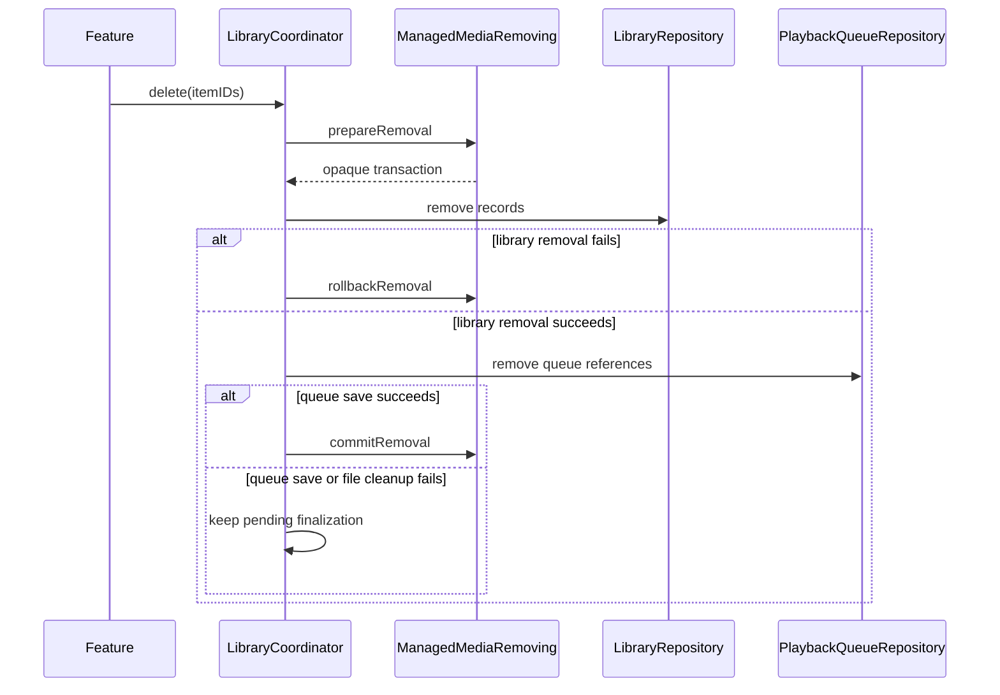
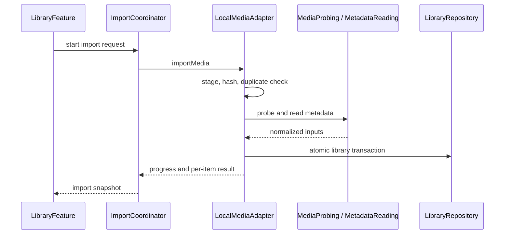
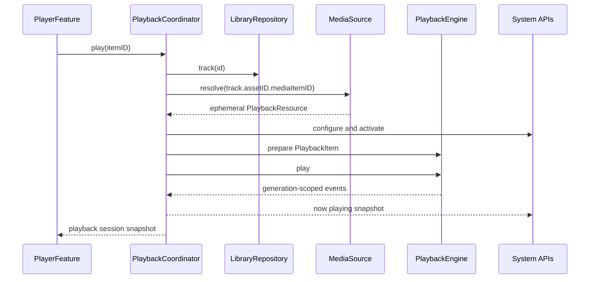

# MusicFree 模块接口基线

> 状态：已冻结；后续仅允许兼容演进  
> 适用版本：首版 iOS/iPadOS 26  
> 文档范围：模块依赖、public API、并发、错误和持久化边界

当前 live 基线：`Local Media vNext` 工作包 A 的本地模型和播放链路已实现；1.2 已加入在线源的协议边界和四 Tab 导航基础。Core/Infrastructure/VLCKit/App 的 iOS generic 构建以及 Core test bundle 构建已通过；本轮模拟器执行在 CoreSimulatorService/测试 worker 阶段阻塞，不能宣称模拟器回归完成。DS Audio、OAuth/DSM Session、远程 Catalog、下载缓存和网盘 Provider 仍未实现。真实设备媒体矩阵、后台/锁屏和发布验收不由模拟器测试替代。

## 1. 目的与阶段边界

本文档把产品级边界落实为可创建、可编译、可测试的 Swift 模块契约。具体实现、测试和发布状态以源码、测试和许可材料为准。

接口冻结必须同时满足：

- 所有 public 类型可在 Swift language mode 6.0、strict concurrency complete 下编译。
- API target 不暴露 SwiftUI、SwiftData、VLCKit、MediaPlayer、AVFAudio 或文件系统实现类型。
- 用 Fake 媒体源、内存 Repository、Fake 播放器可以跑通导入、查询、播放、队列恢复和设置读写用例。
- 队列只持久化稳定 ID 与用户意图，不持久化临时 URL、HTTP header 或 VLCKit 对象。
- `PlaybackCapabilities` 未声明的能力不得被调用，也不得出现在 UI。

## 2. Target 与依赖图

### 2.1 Package 与 Target 清单

```text
MusicFreeApp
├── MusicFreeUI
│   └── DesignSystem / LibraryFeature / PlayerFeature
│       PlaylistFeature / SettingsFeature
├── MusicFreeInfrastructure
│   └── LocalMediaAdapter / LibraryPersistenceAdapter
│       AppleSystemAdapter / PreferencesPersistenceAdapter
├── MusicFreeVLCKitAdapter
│   └── VLCKitPlaybackAdapter
└── MusicFreeCore
    └── MusicDomain / MediaSourceAPI / LibraryAPI / PlaybackAPI
        SystemIntegrationAPI / SettingsAPI / AppServices
        MusicTestSupport (tests only)
```

`SettingsAPI` 与 `PreferencesPersistenceAdapter` 是对总规划的边界补全：设置需要持久化，但 `SettingsFeature` 和 `AppServices` 均不得直接访问 `UserDefaults`。`MusicTestSupport` 只供测试 target 使用，不得成为产品 target 依赖。

Package 依赖固定为：

- `MusicFreeCore` 不依赖其他本地 Package 或第三方二进制。
- `MusicFreeInfrastructure` 只依赖 `MusicFreeCore`。
- `MusicFreeVLCKitAdapter` 依赖 `MusicFreeCore` 与精确版本的远端 `MusicFreeVLCKit` 二进制包；Gate A0 只创建空 target，09 PLAN 才加入并解析二进制依赖。
- `MusicFreeUI` 只依赖 `MusicFreeCore`。
- `MusicFreeApp` 负责组合四个 Package，任何 Package 都不得反向依赖 App。

不采用“每个 target 一个 Package”：target 已提供编译模块边界，四个 Package 进一步隔离依赖解析和 ownership，避免为 19 个逻辑模块维护 19 份 manifest。

### 2.2 允许依赖

| Target | 直接依赖 |
| --- | --- |
| `MusicDomain` | Foundation |
| `MediaSourceAPI` | MusicDomain |
| `LibraryAPI` | MusicDomain |
| `PlaybackAPI` | MusicDomain、MediaSourceAPI |
| `SystemIntegrationAPI` | MusicDomain、PlaybackAPI |
| `SettingsAPI` | MusicDomain、MediaSourceAPI、PlaybackAPI |
| `AppServices` | MusicDomain、全部 API target |
| `LocalMediaAdapter` | MusicDomain、MediaSourceAPI、LibraryAPI |
| `LibraryPersistenceAdapter` | MusicDomain、LibraryAPI、PlaybackAPI、SwiftData |
| `VLCKitPlaybackAdapter` | MusicDomain、MediaSourceAPI、PlaybackAPI、VLCKit |
| `AppleSystemAdapter` | MusicDomain、PlaybackAPI、SystemIntegrationAPI、AVFAudio、MediaPlayer |
| `PreferencesPersistenceAdapter` | SettingsAPI、Foundation |
| `DesignSystem` | SwiftUI |
| Feature targets | MusicDomain、AppServices、必要的 API target、DesignSystem、SwiftUI |
| `MusicFreeApp` | AppServices、Feature targets、Adapter targets |
| `MusicTestSupport` | MusicDomain、全部 API target |

Feature 可以读取 API 中的值类型和能力快照，但所有业务命令必须经由 AppServices，不能直接调用 Repository、PlaybackEngine 或系统 Adapter。

### 2.3 禁止依赖

- API、Domain、AppServices 和 Feature 不得 `import VLCKit`。
- 除 `LibraryPersistenceAdapter` 外不得 `import SwiftData`。
- 除 `AppleSystemAdapter` 外不得直接使用 `AVAudioSession`、`MPNowPlayingInfoCenter`、`MPRemoteCommandCenter`。
- Feature 不得依赖任何 Adapter target。
- Adapter 之间不得直接依赖；组合只发生在 `MusicFreeApp`。
- 任何 target 都不得依赖或链接 `amperfy` 目录中的源码与资源。

## 3. 通用契约规则

### 3.1 值、并发与时间

- 跨 actor 传递的 public 值类型必须为 `Sendable`；需持久化的稳定模型同时为 `Codable`。
- 播放引擎、系统音频会话和 Now Playing 协议标记 `@MainActor`；数据库和文件工作不能在 MainActor 执行。
- 长任务用 `AsyncThrowingStream` 返回进度；订阅结束或 Task 取消后必须释放 continuation。
- 测试涉及当前时间、随机和 UUID 时，从 `AppDependencies` 注入 `Clock`、随机源和 ID 生成器，不直接依赖全局状态。
- 对外持续时间统一使用 `Duration`；持久化 Adapter 自行转换，不向 API 暴露存储单位。

### 3.2 标识与生命周期

- `MediaSourceID` 标识来源实例；首版内置本地源使用稳定保留值。
- `MediaItemID` 由 `sourceID + externalID` 构成，跨导入、重启和迁移保持稳定。
- `PlaybackResource` 是一次解析得到的短生命周期对象，只能传给播放或探测，不进入队列和数据库。
- 远程资源只是未来扩展点；首版没有任何实现生成 `.remote`。
- 封面以 `ArtworkID` 引用，原图和派生图均可重建，不嵌入 `Track`。

### 3.3 错误与取消

- 每个 API 定义可分类的领域错误，保留 `isRetryable`、用户可理解原因和可选底层诊断，不把第三方错误直接抛到 Feature。
- 用户取消是独立结果，不记为失败，不显示错误提示。
- 批量导入允许逐项失败，最终结果明确 imported、duplicate、skipped、failed、cancelled 数量。
- 播放错误必须带 generation 与 item ID；过期 generation 的错误由 Adapter 丢弃。
- 凭据、远程 header、完整用户路径不得出现在错误描述、日志或持久化队列中。

### 3.4 API 演进

- 冻结后 public API 的破坏性变更必须先更新本文档、契约测试和所有 Fake。
- 可选能力先增加 capability，再增加命令；不能先暴露永远失败的方法。
- 第三方 API 变化只修改 Adapter；若必须修改领域接口，需记录独立架构决定。

## 4. `MusicDomain`

`MusicDomain` 只保存稳定业务词汇，不保存行为实现或基础设施信息。

| 文件 | Public 类型 |
| --- | --- |
| `MediaIdentifiers.swift` | `MediaSourceID`、`MediaItemID`、`AlbumID`、`ArtistID`、`GenreID`、`PlaylistID`、`ArtworkID` |
| `LibraryModels.swift` | `Track`、`AlbumType`、`Album`、`Artist`、`Genre`、`LibraryFolder`、`Playlist`、`PlaylistEntry` |
| `MediaTechnicalInfo.swift` | `MediaTechnicalInfo`、`AudioStreamInfo`、`ChannelLayout` |
| `ArtworkModels.swift` | `ArtworkReference`、`ArtworkVariant` |
| `PlaybackStatistics.swift` | `PlaybackStatistics`、`PlaybackCompletionReason` |
| `DomainError.swift` | `MusicDomainError`、`DiagnosticContext` |

约束：

- 模型是不可变 `struct`；关系使用 ID，不形成可变对象图。
- `Track` 保存标题、排序标题、关联 ID、可选曲号/碟号、逻辑文件夹、时长、技术信息、封面引用、收藏状态和统计摘要；逻辑文件夹不是绝对文件系统路径。
- `Album` 保存标题、艺人关系、封面、可选发行年份/曲目数和 `AlbumType`；未知类型保留原始 code。
- `LibraryFolder` 只暴露规范化逻辑路径和歌曲数，不泄漏用户绝对路径。
- 未知 metadata 使用 `nil`，不使用空字符串或由文件扩展名推断的伪值。
- `Playlist` 只保存歌单元数据；成员顺序由 `PlaylistEntry.position` 表达。

## 5. `MediaSourceAPI`

### 5.1 文件与职责

| 文件 | Public 契约 |
| --- | --- |
| `MediaSource.swift` | `MediaSource`、`MediaSourceChangesProviding`、`MediaSourceDescriptor`、`MediaSourceCapabilities`、`MediaSourceCursor`、`MediaSourceChange` |
| `MediaSourceRegistry.swift` | `MediaSourceResolving`，按 `MediaSourceID` 查找来源 |
| `OnlineSourceAPI.swift` | `OnlineSource`、`DownloadSource`、`SearchableDownloadSource`、`PlaybackSource`、来源配置、Catalog、下载回执和试听访问模型 |
| `PlaybackResource.swift` | `PlaybackResource`、`RemotePlaybackRequest`；明确临时、不可持久化 |
| `ArtworkResource.swift` | `ArtworkResource`，提供本地 URL 或短生命周期数据流描述 |
| `MediaImporting.swift` | `MediaImporting`、request/event/result/error/cancellation 模型 |
| `ManagedMediaRemoving.swift` | 可恢复删除 transaction 的 prepare/commit/rollback 协议 |
| `MediaProbing.swift` | `MediaProbing`、`MediaProbeResult`、`ProbedAudioTrack` |
| `MetadataReading.swift` | `MetadataReading`、`RawMediaMetadata`、`RawArtwork` |

### 5.2 核心协议

```swift
public protocol MediaSource: Sendable {
  var descriptor: MediaSourceDescriptor { get }
  var capabilities: MediaSourceCapabilities { get }

  /// Resolves the source-local physical asset identity. For a logical CUE
  /// track, callers pass `track.assetID.mediaItemID`; the logical range and
  /// audio-stream choice remain in `PlaybackItem.selection`.
  func resolve(_ assetID: MediaItemID) async throws -> PlaybackResource
  func artwork(for artworkID: ArtworkID) async throws -> ArtworkResource?
}

public protocol MediaSourceChangesProviding: MediaSource {
  func changes(since cursor: MediaSourceCursor?)
    -> AsyncThrowingStream<MediaSourceChange, Error>
}

public protocol MediaSourceResolving: Sendable {
  func source(for sourceID: MediaSourceID) async throws -> any MediaSource
}

public protocol MediaImporting: Sendable {
  func importMedia(_ request: MediaImportRequest)
    -> AsyncThrowingStream<MediaImportEvent, Error>
  func cancelImport(_ importID: UUID) async
}

public protocol ManagedMediaRemoving: Sendable {
  func pendingRemovals() async throws -> [MediaRemovalTransaction]
  func prepareRemoval(of itemIDs: Set<MediaItemID>) async throws
    -> MediaRemovalTransaction
  func commitRemoval(_ transaction: MediaRemovalTransaction) async throws
  func rollbackRemoval(_ transaction: MediaRemovalTransaction) async throws
}

public protocol MediaProbing: Sendable {
  func probe(_ resource: PlaybackResource) async throws -> MediaProbeResult
}

public protocol MetadataReading: Sendable {
  func readMetadata(from resource: PlaybackResource) async throws
    -> RawMediaMetadata
}
```

`MediaRemovalTransaction` 只暴露 opaque ID 和待删除 item ID；隔离区路径属于 Adapter 私有信息。Adapter 必须保存 pending transaction，使 App 重启时可以根据资料库记录是否仍存在来选择 rollback 或继续 finalize。`RemotePlaybackRequest` 可包含 URL、请求 header 和过期时间，但必须标记为敏感、不可记录、不可持久化。

### 5.3 在线源协议（1.2）

`OnlineSourceAPI.swift` 是工作包 B 的协议基础。它只定义来源实例、远程 Catalog、下载和临时试听访问，不包含 URLSession、OAuth、DSM SDK、SwiftData、文件缓存或 VLCKit 实现。

#### 来源实例与配置

- `OnlineProviderKind` 只代表协议族；每一个账号、NAS 或网关配置都必须拥有独立的 `MediaSourceID`，同一种 Provider 可以同时存在多个不同配置。
- `OnlineSourceConfiguration` 是可持久化的非敏感配置：来源 ID、Provider 类型、显示名、规范化 HTTP/HTTPS endpoint、可选根对象、`credentialRecordID` 和启用状态。
- endpoint 不得包含 userinfo、query 或 fragment；访问令牌、Cookie、OAuth refresh token、完整远程路径和短期 URL 不进入配置、日志、错误或队列。
- `SourceObjectID` 是来源内部对象 ID，不能与 `MediaItemID` 混用。`SourceCatalogItem` 是浏览快照，不是资料库记录；下载后必须交给 `MediaImporting`，由现有本地导入链路生成资料库数据。

#### 下载源与播放源

```swift
public protocol DownloadSource: OnlineSource {
  func browse(_ request: SourceBrowseRequest) async throws -> SourceCatalogPage
  func download(_ itemID: SourceObjectID,
                options: DownloadOptions) async throws -> DownloadReceipt
}

public protocol SearchableDownloadSource: DownloadSource {
  func search(_ request: SourceSearchRequest) async throws -> SourceCatalogPage
}

public protocol PlaybackSource: DownloadSource {
  func playbackAccess(for itemID: SourceObjectID,
                      purpose: PlaybackPurpose) async throws -> PlaybackAccess
}
```

- 下载源必须支持浏览和下载；搜索是可选能力，UI 只能依据 `OnlineSourceCapabilities.searching` 暴露搜索入口。
- 播放源继承下载源，因此播放源理论上都具备下载能力。`playbackAccess` 可以返回 HTTP 试听请求、HTTP 转码请求描述，或明确要求先下载。
- 1.2 的在线播放只支持 `PlaybackPurpose.audition`：不进入正式队列、不写播放历史、不承诺后台连续播放、锁屏控制或自动切歌。VLC 的 HTTP 播放由适配器负责，API 不直接暴露 VLC 类型。
- `DownloadReceipt` 和 `PlaybackAccess` 都是短生命周期、不可 Codable 的值；文件 URL、HTTP header、授权信息和短期 URL 只能在一次下载/试听调用链中传递。

#### 1.2 Provider 边界

| Provider | 1.2 目标 | 协议形态 |
| --- | --- | --- |
| DS Audio | 浏览、可选搜索、下载、HTTP/转码 URL 试听 | `SearchableDownloadSource` + `PlaybackSource` |
| Google Drive | OAuth、Catalog、下载，下载后复用本地导入和本地播放 | `DownloadSource` |
| 百度网盘 | 只保留后续接入扩展点，不进入本版实现和验收 | `OnlineProviderKind.baiduPan` / Provider 工厂扩展 |

Provider 的隐私同意和启用状态由上层来源管理服务统一裁决：应用在线源总开关关闭或应用隐私协议撤销时，所有在线源网络能力必须失效；单个来源实例仍需单独同意、单独撤销。已完成下载并导入的本地媒体不受在线协议撤销影响。

## 6. `LibraryAPI`

| 文件 | Public 契约 |
| --- | --- |
| `LibraryQueries.swift` | `TrackQuery`、`AlbumQuery`、`ArtistQuery`、`GenreQuery`、`LibraryPageRequest`、排序与过滤枚举 |
| `LibraryPage.swift` | `LibraryPage<Element>`、游标与是否存在下一页 |
| `LibraryRepository.swift` | 单项读取、实际封面引用检查、分页查询、事务写入、删除、变更流 |
| `LibraryTransaction.swift` | `LibraryTransaction`、upsert、关系和统计 mutation |
| `PlaylistRepository.swift` | 歌单 CRUD、成员插入/移动/移除、批量重排 |
| `PlaybackHistoryRepository.swift` | 播放开始、有效播放、完成、最近播放记录和清空历史 |
| `LibraryError.swift` | 查询、冲突、约束、迁移与容量错误 |

```swift
public protocol LibraryRepository: Sendable {
  func track(id: MediaItemID) async throws -> Track?
  func album(id: AlbumID) async throws -> Album?
  func artist(id: ArtistID) async throws -> Artist?
  func isArtworkReferenced(_ artworkID: ArtworkID) async throws -> Bool
  func tracks(matching query: TrackQuery,
              page: LibraryPageRequest) async throws -> LibraryPage<Track>
  func albums(matching query: AlbumQuery,
              page: LibraryPageRequest) async throws -> LibraryPage<Album>
  func artists(matching query: ArtistQuery,
               page: LibraryPageRequest) async throws -> LibraryPage<Artist>
  func genres(matching query: GenreQuery,
              page: LibraryPageRequest) async throws -> LibraryPage<Genre>
  func folders(page: LibraryPageRequest) async throws -> LibraryPage<LibraryFolder>
  func apply(_ transaction: LibraryTransaction) async throws
  func remove(_ itemIDs: Set<MediaItemID>) async throws
  func changes() -> AsyncStream<LibraryChange>
}

public protocol PlaylistRepository: Sendable {
  func playlists(page: LibraryPageRequest) async throws -> LibraryPage<Playlist>
  func entries(in playlistID: PlaylistID) async throws -> [PlaylistEntry]
  func create(_ draft: PlaylistDraft) async throws -> Playlist
  func update(_ mutation: PlaylistMutation) async throws -> Playlist
  func apply(_ mutation: PlaylistEntriesMutation) async throws
  func delete(_ playlistID: PlaylistID) async throws
}
```

Repository 必须保证一次 `LibraryTransaction` 原子提交。批量重排由一个 mutation 完成，不能让 UI 连续写入 position 造成中间态。

## 7. `PlaybackAPI`

### 7.1 文件与职责

| 文件 | Public 契约 |
| --- | --- |
| `PlaybackModels.swift` | `PlaybackState`、`PlaybackPhase`、`PlaybackEvent`、`PlaybackError`、`PlaybackGeneration` |
| `PlaybackItem.swift` | `PlaybackItem`，包含 item ID、解析资源和显示快照 |
| `PlaybackEngine.swift` | 当前资源的 prepare/control/event 协议，以及可选的音量/静音控制 |
| `PlaybackCapabilities.swift` | `PlaybackCapabilities` 与运行时 EQ 描述 |
| `PlaybackQueue.swift` | snapshot、entry、repeat/shuffle 模式与编辑命令 |
| `PlaybackQueueRepository.swift` | 队列快照加载和保存 |
| `AudioEffects.swift` | EQ、ReplayGain、transition、rate 配置 |
| `AudioVisualizationProviding.swift` | 可选分析帧流，不承诺 PCM tap |

### 7.2 播放引擎

```swift
@MainActor
public protocol PlaybackEngine: AnyObject {
  var capabilities: PlaybackCapabilities { get }
  var equalizerDescriptor: EqualizerDescriptor? { get }
  var state: PlaybackState { get }

  func makeEventStream() -> AsyncStream<PlaybackEvent>
  func prepare(_ item: PlaybackItem, startAt: Duration?) async throws
  func play() throws
  func pause()
  func stop()
  func seek(to position: Duration) async throws
  func setRate(_ rate: Float) throws
  func apply(_ effects: AudioEffectConfiguration) throws
  func dispose()
}
```

约束：

- `prepare` 成功仅表示资源已交给引擎并进入可播放生命周期，不等同于已开始输出声音。
- `PlaybackEvent` 必须携带 generation；`PlaybackCoordinator` 只接收当前 generation。
- `stop` 清空当前播放会话但不修改 App 队列。
- `PlaybackEngine` 不负责自动下一曲、随机、循环、恢复和队列持久化。
- `makeEventStream()` 支持一个协调器订阅；Adapter 必须记录并断言重复活动订阅，避免不明确的广播语义。

引擎可选实现 `PlaybackAudioControlling`，通过归一化 `0...1` 音量和静音状态提供软件输出控制；该状态不进入持久化队列或 `PlaybackSessionSnapshot`。

### 7.3 队列与能力

`PlaybackQueueSnapshot` 保存有序 `MediaItemID`、当前 entry ID、repeat/shuffle 模式、随机顺序种子与可恢复播放位置。它不保存 `PlaybackResource`。

`PlaybackCapabilities` 至少包含 seeking、variableRate、equalizer、replayGain、gapless、crossfade、visualization。EQ 的频段、增益范围与可用预设由 `PlaybackEngine.equalizerDescriptor` 在运行时提供，不固定为十段；预设携带具体增益配置，设置持久化不依赖 adapter preset ID。

调用不支持的命令必须返回 `PlaybackError.unsupportedCapability`，但正常 UI 不应产生该调用。

## 8. `SystemIntegrationAPI`

| 文件 | Public 契约 |
| --- | --- |
| `AudioSessionManaging.swift` | 配置、激活、停用、route/interruption/media reset 事件 |
| `NowPlayingPublishing.swift` | 发布或清除标准化 Now Playing snapshot |
| `RemoteCommandReceiving.swift` | play/pause/toggle/next/previous/seek/rate 事件流和可用性更新 |
| `SystemIntegrationError.swift` | 会话、命令注册和发布失败 |

```swift
@MainActor
public protocol AudioSessionManaging: AnyObject {
  func configureForPlayback() throws
  func activate() async throws
  func deactivate() async
  func makeEventStream() -> AsyncStream<AudioSessionEvent>
}

@MainActor
public protocol NowPlayingPublishing: AnyObject {
  func publish(_ snapshot: NowPlayingSnapshot)
  func clear()
}

@MainActor
public protocol RemoteCommandReceiving: AnyObject {
  func makeCommandStream() -> AsyncStream<RemotePlaybackCommand>
  func setEnabledCommands(_ commands: Set<RemoteCommandKind>)
}
```

Apple 框架对象、selector、command token 和音频 route 对象不得离开 Adapter。

## 9. `SettingsAPI`

| 文件 | Public 契约 |
| --- | --- |
| `AppSettings.swift` | `AppSettings`、导入策略、默认 rate、ReplayGain 与 transition 偏好 |
| `SettingsRepository.swift` | load/save/reset 与设置变更流 |
| `SettingsError.swift` | 解码、版本和写入错误 |
| `StorageMaintenance.swift` | 存储占用快照、用户确认的维护动作、结果与 `StorageMaintenanceServing` |

```swift
public protocol SettingsRepository: Sendable {
  func load() async throws -> AppSettings
  func save(_ settings: AppSettings) async throws
  func reset() async throws
  func changes() -> AsyncStream<AppSettings>
}
```

```swift
public protocol StorageMaintenanceServing: Sendable {
  func usage() async throws -> StorageUsageSnapshot
  func perform(_ actions: Set<StorageMaintenanceAction>) async throws -> StorageMaintenanceResult
  func pruneOrphanedArtwork() async throws -> StorageMaintenanceResult
  func pruneCache(to limit: StorageByteLimit, retainingStagingFor retention: Duration) async throws -> StorageMaintenanceResult
}
```

设置只保存用户意图。最终可用能力由 `AppSettings` 与当前 `PlaybackCapabilities` 取交集，不把某次 alpha 运行时能力写成永久事实。

## 10. `AppServices`

### 10.1 内部协调器

| 文件 | 职责 |
| --- | --- |
| `AppDependencies.swift` | 显式依赖集合与构造校验 |
| `MediaSourceRegistry.swift` | 来源注册与查找，不包含具体协议逻辑 |
| `ImportCoordinator.swift` | 导入生命周期、进度转发和取消 |
| `LibraryCoordinator.swift` | 查询、收藏、删除与恢复编排 |
| `PlaylistCoordinator.swift` | 歌单命令和一致性 |
| `PlaybackCoordinator.swift` | 资源解析、队列、引擎、音频会话、Now Playing、远程命令 |
| `SettingsCoordinator.swift` | 设置校验、持久化与能力裁剪 |

### 10.2 Feature 可调用接口

Feature 只持有以下 façade，不持有 Repository 或 Adapter：

```swift
public protocol LibraryServing: Sendable {
  func track(id: MediaItemID) async throws -> Track?
  func browseTracks(matching query: TrackQuery, page: LibraryPageRequest) async throws -> LibraryPage<Track>
  func browseAlbums(matching query: AlbumQuery, page: LibraryPageRequest) async throws -> LibraryPage<Album>
  func browseArtists(matching query: ArtistQuery, page: LibraryPageRequest) async throws -> LibraryPage<Artist>
  func browseGenres(matching query: GenreQuery, page: LibraryPageRequest) async throws -> LibraryPage<Genre>
  func browseFolders(page: LibraryPageRequest) async throws -> LibraryPage<LibraryFolder>
  func recentTracks(page: LibraryPageRequest) async throws -> LibraryPage<Track>
  func recentHistory(page: LibraryPageRequest) async throws -> LibraryPage<PlaybackHistoryItem>
  func clearPlaybackHistory() async throws
  func searchTracks(text: String, page: LibraryPageRequest) async throws -> LibraryPage<Track>
  func setFavorite(_ isFavorite: Bool, for itemID: MediaItemID) async throws -> Track
  func delete(_ itemIDs: Set<MediaItemID>) async throws -> LibraryDeletionResult
  func recoverPendingRemovals() async throws -> LibraryRecoveryResult
  func makeChangeStream() async -> AsyncStream<LibraryChange>
}

public protocol ImportServing: Sendable {
  func start(_ request: MediaImportRequest) async throws -> AsyncThrowingStream<MediaImportEvent, Error>
  func cancel(_ importID: UUID) async
  func state(for importID: UUID) async -> ImportSessionSnapshot?
  func makeStateStream() async -> AsyncStream<ImportSessionSnapshot>
}

public protocol ArtworkServing: Sendable {
  func artwork(for artworkID: ArtworkID, sourceID: MediaSourceID) async throws -> ArtworkResource?
}

public protocol PlaylistServing: Sendable {
  func playlists(page: LibraryPageRequest) async throws -> LibraryPage<Playlist>
  func entries(in playlistID: PlaylistID) async throws -> [PlaylistEntry]
  func create(_ draft: PlaylistDraft) async throws -> Playlist
  func update(_ mutation: PlaylistMutation) async throws -> Playlist
  func apply(_ mutation: PlaylistEntriesMutation) async throws
  func delete(_ playlistID: PlaylistID) async throws
}

@MainActor
public protocol PlaybackServing: AnyObject {
  var snapshot: PlaybackSessionSnapshot { get }
  func makeSnapshotStream() -> AsyncStream<PlaybackSessionSnapshot>
  func send(_ command: PlaybackSessionCommand) async
  func execute(_ command: PlaybackSessionCommand) async throws
}

@MainActor
public protocol PlaybackAudioServing: AnyObject {
  var volume: Float { get }
  var isMuted: Bool { get }
  func setVolume(_ volume: Float) async
  func setMuted(_ isMuted: Bool) async
}

public protocol SettingsServing: Sendable {
  func load() async throws -> AppSettings
  func update(_ settings: AppSettings) async throws
  func reset() async throws
  func effective() async throws -> EffectivePlaybackSettings
  func makeChangeStream() async -> AsyncStream<AppSettings>
}
```

资料库到播放列表的写入仍遵守 façade 边界：`LibraryFeature` 只把单曲 ID 或经 `LibraryServing` 完整分页解析后的专辑/流派歌曲 ID 交给 `PlaylistServing`。选择已有目标时先读取 `entries(in:)`，过滤重复成员后以一次 `.insert` mutation 追加；新建目标先调用 `create(_:)`，再走相同成员追加路径。Feature 不直接访问 `PlaylistRepository`、SwiftData 或 `PlaylistFeature` 的内部 ViewModel。

`PlaybackSessionCommand` 是用户意图，例如 play item、toggle、seek、next、edit queue；它不是 VLCKit 命令。`PlaybackSessionSnapshot` 是 Feature 唯一观察的播放会话状态，合并当前歌曲、标准化引擎状态、队列摘要、能力与生效音效。

### 10.3 删除事务顺序



删除是可恢复 saga，不伪装成跨文件系统和数据库的原子事务：资料库删除前失败则恢复隔离文件；资料库删除成功后，队列裁剪或文件清理失败时不恢复已删除记录，而是保留 pending transaction。启动恢复逐项检查：记录仍存在则 rollback 文件；记录已不存在则再次裁剪队列并 commit 文件清理。该阶段必须记录脱敏诊断并在设置页提供存储维护状态。

## 11. Adapter 公开边界

Adapter 仅向 Composition Root 暴露具体类型及 initializer，行为通过 API 协议使用。

| Adapter | Public 构造边界 | 实现协议 |
| --- | --- | --- |
| `LocalMediaAdapter` | managed root、staging root、probe、metadata reader、library repo、hashing | `MediaSource`、`MediaImporting`、`ManagedMediaRemoving` |
| `LibraryPersistenceAdapter` | `ModelContainer` 或 store configuration | `LibraryRepository`、`PlaylistRepository`、`PlaybackHistoryRepository`、`PlaybackQueueRepository` |
| `VLCKitPlaybackAdapter` | VLC options、capability policy、diagnostics | `PlaybackEngine`、`MediaProbing`、`MetadataReading`、可选 visualization |
| `AppleSystemAdapter` | 系统中心和 session 的默认或测试注入 | `AudioSessionManaging`、`NowPlayingPublishing`、`RemoteCommandReceiving` |
| `PreferencesPersistenceAdapter` | suite/key/codec 依赖 | `SettingsRepository` |

所有 Adapter initializer 均可失败并返回结构化配置错误；App 启动时不允许用 `fatalError` 掩盖可恢复的 store 或依赖问题。

## 12. Feature 与 App 入口

| Target | 唯一 public 入口 |
| --- | --- |
| `LibraryFeature` | `LibraryHomeViewController`、`LibraryCollectionsViewController`、`LibraryCollectionDetailViewController`、`LibraryTracksViewController` 及详情/编辑控制器 |
| `PlayerFeature` | `PlayerMiniPlayerViewController`、`PlayerNowPlayingViewController`、`PlayerQueueViewController`、`PlayerLyricsViewController` |
| `PlaylistFeature` | `PlaylistListViewController`、`PlaylistDetailViewController` |
| `SettingsFeature` | `SettingsScene`（Settings SwiftUI 宿主）与 `OnlineSourcesViewController` |
| `MusicFreeApp` | `MusicFreeApp`、`AppContainer`、路由和 scene composition |

Feature 内部 ViewModel 默认 `@MainActor`，只把用户动作转换为 façade 命令。Feature 不公开自身状态作为其他 Feature 的数据源；跨 Feature 状态由 AppServices 提供，导航由 App target 负责。

## 13. `MusicTestSupport`

测试支持 target 提供：

- `FakeMediaSource`、`FakeMediaImporter`、`FakeManagedMediaRemover`
- `InMemoryLibraryRepository`、`InMemoryPlaylistRepository`、`InMemoryPlaybackQueueRepository`
- `FakePlaybackEngine`、可脚本化事件与 capability snapshot
- `FakeAudioSessionManager`、`FakeNowPlayingPublisher`、`FakeRemoteCommandReceiver`
- `InMemorySettingsRepository`
- `TestClock`、`DeterministicRandomSource`、`SequentialIDGenerator`

Fake 必须遵循与真实 Adapter 相同的取消、事件顺序和不支持能力语义。契约测试以共享 test suite 同时验证 Fake 与真实 Adapter，防止 Fake 过度宽松。

## 14. 关键数据流

### 14.1 导入



### 14.2 播放



## 15. 接口冻结验收

- [x] 所有 target 及测试 target 在不链接 VLCKit binary 的 Fake 配置下编译。
- [x] Xcode iOS test runner 通过 ID Codable、查询分页、事务、队列、能力裁剪和事件顺序测试。
- [x] 完整导入用例可用 Fake 从 request 走到 library snapshot。
- [x] 完整播放用例可用 Fake 从 item ID 走到 prepare/play/next/queue save。
- [x] 删除失败可演示资料库删除前 rollback，以及删除后崩溃重启继续 finalize，状态没有不可解释的分裂。
- [x] 对源码执行 import 规则检查，禁止层级逆向依赖。
- [x] `PlaybackResource`、远程 header 和安全作用域 URL 未进入 Codable 持久化模型。
- [x] API 文档明确取消、重试、事件终止、MainActor 和 capability 语义。
- [x] 本文档中的 target 名称、依赖和 public API 与工程保持一致。

接口冻结后，public API 只允许兼容演进，并必须先更新本基线和契约测试。
